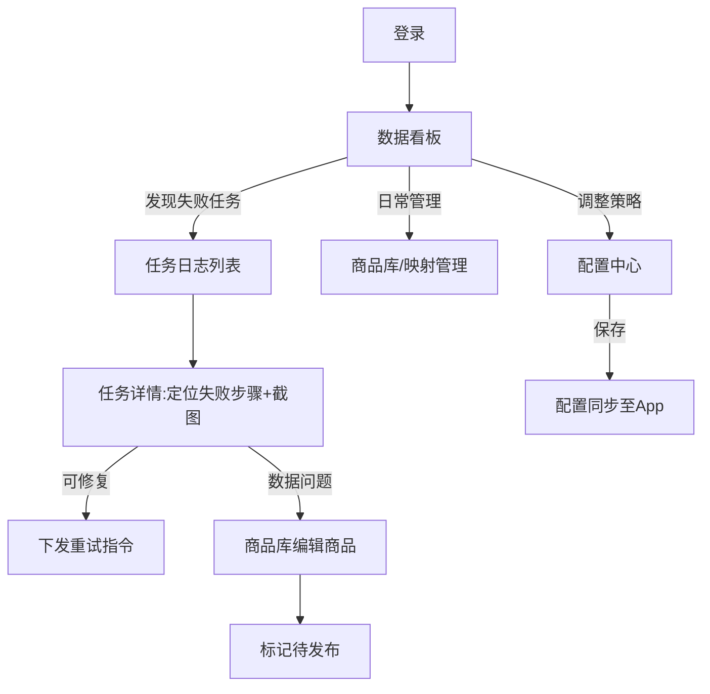

# 产品需求文档(PRD)—— 电商自动化助手 · 管理后台
> 版本:v1.0 | 日期:2026-07-26 | 状态:待确认

## 1. 产品概述

**一句话定位**:为「电商自动化助手」(Android 端 1688 采集 → AI 优化 → 千牛发布工具)配套的 Web 管理后台,让卖家在桌面端集中查看经营数据、管理商品与映射关系、跟踪自动化任务、维护系统配置。

**解决的核心问题**:
- 手机端 App 屏幕小、操作碎片化,不适合批量查看和管理数据
- 采集/发布任务的成败情况分散在手机里,缺乏全局视角
- 加价规则、AI 配置等设置项在手机上维护效率低
- 小团队协作时,数据锁在单台手机上,无法共享

**分期规划**:
- **一期(本 PRD 范围)**:Web 管理后台,桌面端优先、兼容平板
- **二期(后续单独立项)**:移动端 H5,复用后台 API,聚焦「随时看数据 + 处理异常任务」的轻场景

## 2. 目标用户与场景

**用户画像**:
- **店主(管理员)**:淘宝/天猫卖家本人,关心整体经营数据,负责配置加价规则和 AI 参数,管理团队账号
- **运营(操作员)**:店主本人或 1~3 名协作人员,日常查看商品库、处理失败任务、维护映射关系

**核心使用场景**:
1. 早上打开后台,在数据看板查看昨日/今日的采集量、发布量、成功率,发现异常趋势
2. 发布任务失败后,在任务日志中查看失败步骤和现场截图,定位原因后重试或手动处理
3. 批量检视已采集商品,编辑 AI 优化后的标题/价格,确认后标记为「待发布」
4. 查询某个 1688 商品对应的淘宝商品,核对 SKU 映射关系
5. 调整加价规则或更换 AI API Key,配置即刻同步给手机端 App

## 3. 功能清单

| 模块 | 功能 | 描述 | 优先级 |
|------|------|------|--------|
| 账号 | 登录/登出 | 账号密码登录,JWT 会话;无自助注册,管理员创建账号 | P0 |
| 账号 | 角色区分 | 管理员(全部权限)/ 操作员(不可进配置中心、不可管理账号) | P1 |
| 账号 | 成员管理 | 管理员增删成员、重置密码 | P1 |
| 数据看板 | 核心指标卡 | 今日采集数、今日发布数、发布成功率、待处理失败任务数 | P0 |
| 数据看板 | 趋势图 | 近 7/30 天采集与发布数量趋势(折线图) | P0 |
| 数据看板 | 失败原因分布 | 近 30 天任务失败原因占比(饼图/条形图) | P1 |
| 商品库 | 商品列表 | 已采集商品分页列表:主图、标题、采集价、建议售价、状态(草稿/待发布/已发布/发布失败)、采集时间;支持按状态筛选、关键词搜索 | P0 |
| 商品库 | 商品详情 | 主图轮播、原标题与 AI 优化标题对比、价格明细、SKU 列表、详情图 | P0 |
| 商品库 | 商品编辑 | 修改选用标题、售价、SKU 价格库存;保存后同步给 App | P0 |
| 商品库 | 批量操作 | 批量删除、批量标记待发布 | P1 |
| 映射管理 | 映射列表 | 1688 商品 ↔ 淘宝商品对应关系:双方标题/ID、发布时间、加价规则快照;支持搜索 | P0 |
| 映射管理 | 映射详情 | SKU 级对应关系表、原始采集数据快照 | P1 |
| 映射管理 | 删除映射 | 单条删除(二次确认) | P0 |
| 任务日志 | 任务列表 | 采集/发布任务分页列表:类型、关联商品、状态、开始时间、耗时;按类型/状态/日期筛选 | P0 |
| 任务日志 | 任务详情 | 步骤级日志时间线、失败步骤高亮、失败现场截图查看 | P0 |
| 任务日志 | 失败重试 | 对失败的发布任务下发「重试」指令(App 端执行) | P1 |
| 配置中心 | 加价规则 | 固定加价/百分比加价,设置数值;修改历史记录 | P0 |
| 配置中心 | AI 配置 | 模型选择(通义/OpenAI 兼容)、API Key 维护(脱敏显示) | P0 |
| 配置中心 | 发布默认项 | 默认运费模板、发货地、自动提交/存草稿开关 | P1 |
| 配置中心 | 操作速度 | App 端操作延迟区间(最小/最大毫秒) | P2 |
| 全局 | 设备状态 | 显示手机端 App 最近心跳时间、在线状态 | P2 |

## 4. 页面结构

```
登录页
└─ 主框架(左侧导航 + 顶栏[当前用户/登出])
   ├─ 数据看板(首页)      指标卡 + 趋势图 + 失败原因分布
   ├─ 商品库               列表页 → 详情/编辑页(抽屉或独立页)
   ├─ 映射管理             列表页 → 详情抽屉
   ├─ 任务日志             列表页 → 详情页(步骤时间线 + 截图)
   ├─ 配置中心(仅管理员)  分组表单:加价规则 / AI 配置 / 发布默认项 / 操作速度
   └─ 成员管理(仅管理员)  成员列表 + 新建/重置密码
```

## 5. 核心流程



## 6. 接口需求(后端契约,需与 App/服务端同步实现)

后端服务尚不存在,以下为前端依赖的接口清单,作为后端立项输入:

| 接口 | 方法 | 说明 |
|------|------|------|
| /api/auth/login | POST | 登录,返回 JWT 与角色 |
| /api/dashboard/summary | GET | 看板指标卡数据 |
| /api/dashboard/trend?days=7\|30 | GET | 采集/发布趋势 |
| /api/dashboard/failures?days=30 | GET | 失败原因分布 |
| /api/products | GET/DELETE | 商品分页列表(支持 status、keyword)、批量删除 |
| /api/products/{id} | GET/PUT | 商品详情、编辑保存 |
| /api/mappings | GET | 映射分页列表(支持 keyword) |
| /api/mappings/{id} | GET/DELETE | 映射详情、删除 |
| /api/tasks | GET | 任务分页列表(type、status、日期范围) |
| /api/tasks/{id} | GET | 任务详情(步骤日志、截图 URL) |
| /api/tasks/{id}/retry | POST | 下发重试指令 |
| /api/settings | GET/PUT | 配置读取与保存 |
| /api/members | GET/POST/DELETE | 成员管理(仅管理员) |

**开发策略**:前端按上述契约先行开发,内置可切换的 Mock 层(接口未就绪时用模拟数据),联调时切换到真实 API,保证前端不被后端进度阻塞。

## 7. 非功能需求

- **兼容性**:Chrome/Edge 最新两个大版本;1280px 以上桌面为主,1024px 平板可用
- **性能**:列表页首屏 < 2s(含 mock);分页每页 20 条;图片懒加载
- **安全**:JWT 过期自动跳登录;API Key 界面脱敏(仅显示末 4 位);操作员访问受限页面时前端路由拦截 + 后端鉴权双重校验
- **国际化**:仅中文
- **响应式**:桌面优先;为二期 H5 预留 API 与设计 token 复用

## 8. 不做的事情(Out of Scope)

- ❌ 二期移动端 H5(单独立项,另写 PRD)
- ❌ 后端服务本身的实现(本 PRD 只定义接口契约)
- ❌ 在后台直接执行采集/发布(自动化只能由手机端 App 执行,后台仅下发指令与展示结果)
- ❌ 订单管理、库存同步、买家消息(App 的 V2+ 规划,后台暂不承接)
- ❌ 多店铺管理、商业化账号体系、付费功能
